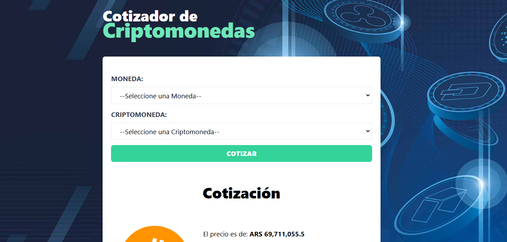

<!-- Banner -->


# 💰 Proyecto: App de Consulta de Criptomonedas

¡Gracias por visitar mi proyecto! Esta aplicación web permite consultar los precios y otra información relevante sobre diversas criptomonedas en tiempo real. La app utiliza la API de [CryptoCompare](https://min-api.cryptocompare.com/) para proporcionar datos precisos y actualizados.

## 🛠️ Tecnologías Utilizadas

- **React**: Librería para construir interfaces de usuario.
- **TypeScript**: Superset de JavaScript que añade tipos estáticos, proporcionando un desarrollo más seguro.
- **Zustand**: Biblioteca para el manejo del estado global de la aplicación.
- **Zod**: Librería para la validación de esquemas de datos.
- **Axios**: Cliente HTTP para realizar las peticiones a la API de CryptoCompare.
- **Tailwind CSS**: Framework de CSS para estilizar la aplicación.
- **Spinners**: Indicadores visuales de carga para mejorar la experiencia de usuario durante la consulta de datos.

## 🌐 Prueba la Aplicación

Puedes probar la aplicación en vivo en [este enlace de Netlify](https://app-cripto.netlify.app/).

## 📝 Funcionalidades Principales

- **Consulta de Precios de Criptomonedas**: Busca y visualiza precios actualizados de las criptomonedas más populares.
- **Detalle de Criptomonedas**: Muestra información detallada como cambios de precio, volúmenes de trading y más.
- **Actualización en Tiempo Real**: Los datos se actualizan directamente desde la API de CryptoCompare.
- **Interfaz Amigable**: Diseñada para proporcionar una experiencia fluida y atractiva.

## 📂 Estructura del Proyecto

```bash
src/
├── components/       # Componentes reutilizables
├── data/             # Datos de los codigos de las monedas de diferentes paises
├── schema/           # Esquema de los datos con Zod
├── store/            # Configuración de Zustand para el estado global
└── types/            # Definiciones de tipos para TypeScript
```
## 🚀 Cómo Empezar
1. Clona el repositorio:

```bash
git clone https://github.com/RodrigoLoboDev/APP-Criptomonedas
```
2. Instala las dependencias:

```bash
npm install
```

3. Inicia el servidor de desarrollo:

```bash
npm run dev
```

## 🤝 Contribuciones
Las contribuciones son bienvenidas. Si tienes ideas para mejorar el proyecto, no dudes en abrir un issue o hacer un pull request.

## 📧 Contacto
- Email: rolobo2812@gmail.com
- LinkedIn: [Jesús Luis Rodrigo Lobo](https://www.linkedin.com/in/jes%C3%BAs-luis-rodrigo-lobo-6594a81b4/)
- GitHub: [RodrigoLoboDev](https://github.com/RodrigoLoboDev)

#### ⭐️ Si te gusta lo que hago, no dudes en seguirme y contribuir a mis proyectos. ⭐️